## **An Exploration of ICT Students’ Learning Experiences in Basic Programming at Senior High Schools Located in Naic**

## **APPROVAL SHEET**

This research paper entitled **“An Exploration of ICT Students’ Learning Experiences in Basic Programming at Senior High Schools Located in Naic”**, prepared and submitted by **Jessie John A. Inocentes, Jayden Ralfh B. Dollaga, Klent Dave B. Rollon, and Daniel Quiñones** in partial fulfillment of the requirements for **Practical Research 1**, is hereby recommended for Oral Examination.

<ins>**Ms. Murielle E. Galicia**</ins>

**Practical Research 1 Adviser**

Approved in partial of the requirements in Practical Research 1

**PANEL OF ORAL DEFENSE**

<ins>**Ms. Murielle E. Galicia**</ins>

**Panelist**

Accepted in partial fulfillment of the requirement in Practical Research 1

<ins>Mrs. Maria Carla A. Nazareno</ins>
**Principal**

---

## **ACKNOWLEDGMENT**

The researchers would like to express their sincere gratitude to everyone who supported and guided them in completing this research study. They are especially thankful to their Practical Research teacher for the patience, guidance, and valuable suggestions that helped improve the study and deepen their understanding of the research process.

The researchers are also deeply grateful to their families for their unconditional love, understanding, and continuous encouragement. Their support provided strength and motivation throughout the challenges encountered during the completion of this study.

They would also like to thank their friends and classmates for their moral support and encouragement. Their positivity and belief in the researchers helped them remain focused and determined.

Above all, the researchers thank God for granting them wisdom, patience, and perseverance to successfully complete this study.

**The Researchers**

---

## **ABSTRACT**

---

## **TABLE OF CONTENTS**

---

## **CHAPTER 1: INTRODUCTION**

### **Background of the Study**

Information and Communication Technology (ICT) education plays a vital role in preparing students for technology-driven careers, especially in fields where problem-solving, logical reasoning, and technical skills are essential. One of the core components of ICT education is computer programming, which not only hones these skills but also encourages creativity, critical thinking, and the ability to systematically troubleshoot problems. Despite its benefits, many ICT students encounter challenges in learning programming, such as understanding complex concepts, debugging errors, and managing multiple programming tasks simultaneously. These difficulties can negatively affect students’ motivation, confidence, and academic performance, and may even influence their decision to continue pursuing ICT-related studies. Therefore, examining students’ experiences and motivation in programming is crucial to providing better guidance, instructional strategies, and learning support tailored to their needs.

Foreign studies show that ICT students face varying levels of motivation depending on their prior exposure to programming. For instance, Al-Kabi, Alsmadi, & Alnaser (2019) found that students who began learning programming before entering university tend to demonstrate higher intrinsic motivation and greater engagement in learning activities, whereas those introduced to programming for the first time at university often rely more on external motivation, such as grades or instructor pressure. These differences in experience significantly influence how students approach learning, manage challenges, and cope with academic demands. Consequently, students with less experience and lower motivation are more likely to encounter learning difficulties, perform poorly, or even drop out of ICT courses.

In the local context, a study conducted at ACLC Antipolo during the school year 2023–2024 revealed that Senior High School ICT students generally view programming as beneficial to their skills development. Despite this positive perception, students reported common challenges such as syntax errors, debugging problems, and difficulty understanding program logic. These challenges affect students’ learning experiences and motivation, indicating that programming remains a demanding subject even at the Senior High School level.

Given these findings, it is important to further examine the experiences and motivation of ICT students in learning programming. Understanding the factors that influence students’ learning experiences can help improve teaching strategies and provide better support for learners. This study aims to explore the experiences and motivation of Senior High School ICT students in programming to better understand the challenges they face and how these affect their learning.

---

### **Statement of the Problem**
This study aims to explore the experiences and motivation of Senior High School ICT students in learning programming. **It also considers the demographic characteristics of the respondents, such as age and gender, as these factors may influence students’ learning experiences, challenges, and motivation in programming.**

Specifically, it seeks to answer the following questions:
1. What is the demographic profile of the respondents in terms of:
  a. Age
  b. Gender
2. What are the learning experiences of ICT students in programming?
3. What challenges do ICT students encounter while learning programming?
4. What motivates ICT students to learn programming?
5. How do students’ experiences influence their motivation in learning programming?

---

### **Conceptual Framework**

This study is anchored on the idea that the learning experiences influence the students’ motivational in learning the Programming. The motivation of the students towards learning programming is very crucial in studying ICT subjects. When learners face challenges or a lack of background knowledge, their motivation can suffer in programming learning.

The prior experience of students with computer programming, the learning problems caused by computer programming activities and their classroom learning experiences are the independent variables of the study. Prior exposure refers to the programming experience students have prior to undertaking ICT subjects. The learning challenges include trouble with program logic, and syntax error behaviour and debugging. Moreover, the methods teachers utilize, learning resources available, and support provided by teacher determines the experience inside a classroom.

An independent variable gives students a lesson on programming, then the teacher applies different methods of teaching, and the student also participates in computer programming. Studetns get motivated and develop perception, attitude, and confidence towards programming.

The dependent variable of this study is the motivation of student learning programming.  The student will show his or her motivation through interest, persistence and willingness to engage in tasks related to programming.  Additionally, enhancing students’ motivation may help them become more engaged and learn more in an ICT subject. 

**Input**

* Prior exposure to programming
* Learning challenges in programming (syntax errors, logic formulation, debugging)
* Classroom learning experiences (teaching strategies, learning resources, teacher support)

**Process**

* Teaching and learning strategies in programming
* Student engagement in hands-on programming activities
* Interaction between students and instructional support
* Data gathering through survey questionnaires and interviews to assess students’ learning experiences, challenges, and motivation in programming.

**Output**

* Increased student motivation in learning programming
* Development of positive attitudes toward programming
* Improved confidence and persistence in solving coding problems
* Enhanced programming skills (coding, debugging, testing, troubleshooting)
* Greater interest in pursuing ICT-related careers and projects

**Explanation/Figure 1**

The **Input-Process-Output (IPO)** model is used in this research to explain the process by which different factors affect the motivation of ICT students learning programming.

The **input variables** are the factors that could potentially influence the learning process of students learning programming. These factors include **prior experience with programming**, **learning difficulties**, and **learning experiences in the classroom**. Prior experience with programming is considered an input variable because students come from different backgrounds, and some students may have already gained knowledge of basic programming concepts, while others need further exposure and practice. Learning difficulties, including syntax errors, difficulties in expressing logic, and debugging, are also considered input variables because these are some of the difficulties that ICT students face, and if not addressed, could have a negative impact on their confidence and interest in programming. Learning experiences in the classroom, including teaching approaches, learning resources, and support from teachers, are also considered input variables because they have a direct impact on how students understand programming concepts and how their learning difficulties are addressed.

The **process** refers to how these input variables interact during the instruction and acquisition of programming knowledge. This involves the **teaching and learning processes** used by the instructors, student **participation in hands-on programming exercises**, and the **interaction between students and teaching assistance**. Through this process, students are able to apply their prior knowledge, develop programming skills, and attempt to overcome difficulties in learning. Hands-on exercises allow students to develop their skills through practice, while instructor assistance and support help students cope with difficulties and maintain their motivation. These classroom interactions influence students’ learning experiences and their perceptions of programming. As part of the process, data are gathered through survey questionnaires and interviews to obtain information on students’ demographic profile, learning experiences, challenges, and motivation in learning programming.

This **output** is the result of the interaction between the identified input variables and the teaching and learning process. After considering the students’ programming experience, learning difficulties, and classroom learning experiences, and applying appropriate teaching strategies, the outcomes are reflected in the students’ level of motivation and the development of their programming skills.

---

### **Significance of the Study**

This study was conducted to determine whether students require proper assistance in learning computer programming, to identify the reasons why many learners struggle with programming concepts, and to provide teachers with practical insights that may help reduce the number of failing students. Given the increasing importance of coding skills in today’s technology-driven society, this research also aims to help bridge gaps between classroom instruction and students’ actual learning experiences.

The findings of this study may benefit the following:

**Students.**
* This study may help ICT students better understand their learning challenges and motivations in programming, allowing them to develop more effective learning strategies.

**Teachers.**
* The results may guide ICT teachers in improving instructional methods, particularly in addressing difficulties such as debugging and syntax errors, and in enhancing student motivation.

**School Administrators.**
* The study may provide insights that can help administrators design better ICT curricula and learning support programs.

**Future Researchers.**
* This research may serve as a reference for future studies related to ICT education, programming instruction, and student motivation.

---

### **Scope and Limitations of the Study**

This study focuses on the experiences and motivation of Senior High School students under the ICT strand. It is limited to students currently enrolled during the specified school year. The study does not include other strands, advanced programming courses, or external factors outside the school environment.

---

### **Definition of Terms**

* **Academic Performance** – Refers to the level of achievement of students in ICT subjects, particularly in programming-related activities and assessments.

* **Classroom Learning Experience** – The teaching methods, learning activities, and instructional support encountered by students during programming lessons.

* **Debugging** – The process of identifying and correcting errors in a computer program.

* **ICT (Information and Communication Technology)** – Refers to the academic strand that focuses on computer systems, programming, and digital technologies.

* **Learning Experience** – The students’ encounters, challenges, and perceptions while studying programming.

* **Motivation** – The factors that influence students’ interest, effort, and persistence in learning programming.

* **Programming** – The process of creating instructions that a computer follows to perform specific tasks.

* **Programming Challenges** – The difficulties students experience in learning programming, such as syntax errors, logic formulation, and debugging.

* **Senior High School Students** – Learners enrolled in Grades 11 and 12 under the ICT strand.

* **Syntax Errors** – Mistakes in the structure or rules of a programming language that prevent a program from running correctly.

---

### **Review of Related Literature**
This chapter presents related foreign and local studies that support the present research and provide background information on ICT students’ experiences and motivation in learning programming.

---

#### **Foreign Studies**

#### **1.1** 
Kori, Pedaste, Leijen, and Tõnisson (2016) investigated the impact of prior programming experience on the motivation and performance of first-year ICT students. The results revealed that students who had learned programming before university enrollment tended to be more motivated and performed significantly better in their studies compared to those who started programming at university. To illustrate, students with programming experience scored higher weighted average grades in their first semester. On the other hand, novices were more externally motivated; according to the study, students who were new to programming showed higher levels of external regulation, such as motivation due to future employment prospects, than those with prior programming experience. Taken together, these results suggest that introducing programming early leads to a more intrinsic form of motivation and provides an advantage in ICT studies.

#### **1.2** 
Qian & Lehman (2017) performed a literature review on misconceptions and difficulties encountered by novice programmers. They found that beginners often face difficulties in more than one dimension: syntactic knowledge (learning language syntax and rules), conceptual knowledge (learning programming concepts and logic), and strategic knowledge (learning how to solve problems). For instance, beginners may have syntax errors in their code or misunderstand the workings of loops and conditionals, which in turn affects their debugging and learning process. In short, these interrelated difficulties make it challenging for students to learn and may demotivate them in introductory programming classes.

#### **1.3** 
A research paper published in Frontiers in Education (2022) explored the link between programming motivation, student engagement, and computational thinking (CT) skills. The results showed that students with prior programming experience tended to have higher levels of intrinsic motivation (interest and enjoyment) towards programming, and intrinsic motivation was a predictor of superior CT performance. High intrinsic programming motivation was a predictor of high CT test scores among students with prior programming experience, while high extrinsic motivation (interest in external rewards) was a predictor of CT skills among students without prior programming experience. In conclusion, prior programming experience seems to boost a student’s internal motivation and improve programming and computational thinking performance.

#### **1.4** 
Abdunabi (2024) investigated the role of programming self-efficacy and its predictors in determining success in IS/ICT-related courses. The author states that, as per expectancy-value theory, students’ expectations of success and the value they place on a task are robust predictors of their performance. The findings of the study support this, as students who value learning programming highly are likely to be more self-sufficient in their efforts and continue for longer periods of time when dealing with complex programming tasks. This indicates that students who are more confident and motivated in programming are likely to perform better and continue with programming-related tasks for longer periods of time.

#### **1.5** 
Cheah’s (2020) systematic review identifies, there are a number of reasons that make learning programming difficult and reduce the motivation of the students. These include the fact that many students do not possess the basic problem-solving skills necessary for breaking down programming tasks. In addition, the traditional learning materials often do not communicate programming ideas effectively; for example, textbooks that do not support the dynamic and visual aspect of programming. Cheah further states that a lack of practical support makes the problem worse because, if students are not directly involved in coding activities, they will not be able to understand the concepts and will quickly lose motivation.

---

#### **Local Studies**

#### **2.1** 
Palawan National School (2023) analyzed the difficulties Grade 12 ICT students face in learning programming. The study concluded that when errors are persistent, it often results in frustration, thus reducing student engagement and making the learning process more complicated. The study observed that if students are not provided with feedback and support to overcome errors, they might develop a negative attitude towards programming, thus affecting their skills and confidence. To overcome these issues, the study suggested some effective solutions, such as the use of real-time debugging tools or extensions that provide immediate feedback, along with more hands-on experience through exercises and tutorials. Moreover, they emphasized the need for supportive learning materials to boost students’ confidence and improve their overall proficiency in programming.

#### **2.2** 
Pasay City South High School (2023) carried out a study to investigate the programming problems encountered by the Grade 11 ICT students. The findings of the study showed that the learners were often faced with problems of error identification and correction, which resulted in frustration and a loss of motivation. The interview analysis showed that the learners often spent too much time on error correction for a particular problem and then encountered more issues, which further contributed to their discouragement. The factors that contributed to this problem were the lack of computer availability and the fast pace of teaching, which further made learning difficult for the students. The study recommended the use of student-centered approaches to teaching, such as slowing down the pace of introducing new material, conducting remedial classes or tutorials, and encouraging group work.

#### **2.3** 
Philippine Science High School (2019) conducted a case study that focused on the programming skills and learning process of Grade 9 students. The results revealed that while most students showed overall competency, they still struggled with common problems related to coding syntax and debugging. The students experienced problems like incorrect syntax and trial-and-error approaches, which impacted their confidence levels and learning process. The study concluded that even competent students need more practice exercises to overcome common technical issues. Offering specific guidance enables learners to maintain their performance and confidence levels, thereby helping them enhance their programming skills effectively.

#### **2.4** 
Young Achievers School of Caloocan (2021) investigated the views of Grade 11 ICT students on coding. The study revealed that despite the students' awareness of the importance of coding skills for their future profession, they still felt anxious and lacked self-confidence when working on coding activities. These emotions often served as barriers because anxious students often froze or gave up when faced with difficult problems to solve. The study emphasized that the students' feelings of anxiety and lack of self-confidence negatively influenced their performance and that psychological assistance, building confidence, and technical assistance are needed to promote positive learning experiences for novice coders.

#### **2.5** 
St. Matthew Academy of Cavite (2022) carried out a research study to investigate the effect of programming instruction on the skills and motivation of ICT students. The study found that students who were taught effectively and supported well showed significantly higher levels of engagement in programming. Experienced teachers who provided clear explanations, practice materials, and collaboration opportunities motivated students to work together, tutor each other, and engage actively in programming tasks. The results of the study concluded that the integration of effective teaching strategies with peer support not only improved students’ programming skills but also boosted their confidence and motivation levels.

---

## **CHAPTER 2: Methodology**

### **Research Design**

This study employed a qualitative descriptive research design to examine the learning experiences of Information and Communication Technology (ICT) students in basic programming at selected senior high schools in Naic, Cavite. This design was chosen to explore students’ experiences, perceptions, and challenges without manipulating any variables. It enabled the researchers to gather detailed descriptions of students’ understanding of programming concepts, the difficulties they encounter, and the strategies they use in learning. The study aims to provide a clear understanding of ICT students’ experiences in basic programming and contribute to improving teaching and learning practices.

---

### **Population of the Study**

The population consisted of fifteen (15) Senior High School ICT students enrolled in basic programming subjects from three selected schools in Naic, Cavite during the school year 2025–2026. The schools included Western Colleges Inc. (WCI), Cavite Community Academy Inc. (CCA), and Immaculate Conception School of Naic Inc. (ICSNI). These students were selected because they are directly involved in learning programming and can provide relevant insights regarding their experiences, challenges, and learning conditions.

---

### **Sampling Method**

Purposive sampling was used to select the participants. This non-probability sampling technique allows the selection of respondents based on specific criteria relevant to the study. The researchers selected ICT students who are currently taking or have taken basic programming subjects. This method ensured that all participants had direct experience with the subject and could provide meaningful information.

---

### **Data Collection Procedure**

Prior to data gathering, the researchers prepared a formal request letter to obtain permission from the administrators and teachers of the three schools. After approval was granted, data were collected through interviews to obtain detailed information about students’ learning experiences in basic programming. Participants were informed about the purpose of the study and assured that their responses would remain confidential and be used only for academic purposes. Five students from each school were interviewed using questions related to their experiences, challenges, and understanding of programming concepts. The responses were organized and analyzed using thematic analysis to identify common patterns and themes. The findings were then interpreted to form conclusions and recommendations.

---

## **CHAPTER 3: RESULTS & DISCUSSION**

This chapter presents the finding of the study based on the data gathered from the fifteen (15) ICT student respondents. The results are organized according to the research questions and analyzed using thematic analysis.

---

### **1.1 Demographic Characteristics of the terms of their age**
|    **AGE**    |    **Respondents**    |
|-----|-----|
| 16-17 years old | 1,2,3,5,7,9,10,11,12,13,14,15 |
| 18-19 years old | 4,6,8 |

**Table 1.1** shows that the majority of the respondents (12 or 80%) are aged 16-17 years old, while three respondents (20%) are aged 18-19 years old. This indicates that most ICT students participating in the study in the study are within the typical age range of Senior High School learners.

---

### **1.2 Demographic Characteristics of the terms of their gender**
|    **GENDER**    |    **Respondents**    |
|-----|-----|
| 16-17 years old | 1,2,3,4,5,7,8,9,10,11,12,13,14,15 |
| 18-19 years old | 6 |

**Table 1.2** reveals that the majority of the respondents are male (14 or 93%), while the only respondents (7%) is female. This suggest the ICT strand is the selected schools is predominantly compose of male students.

---

### **Table 2: The learning experiences of ICT students in programming**
| Q1. What are the learning experiences of ICT students in programming? |
|-----------------------------------------------------------------------|
| "Para sa akin? Noong Grade 8, na-introduce ako ng ICT teacher ko sa HTML. Na-engganyo ako sa paggawa ng code, pag-pro-program. Sinimulan ko sa paggawa ng mga reviewers at kung ano-ano pang projects na pinapagawa niya sa akin. 'Yun lang po." |
| "So, 'yung pinaka-experience ko po sa ICT with programming is tinutulungan po nito ako mag-develop ng practical na skills and hobbies na while at the same time fun, pwede ko pong magamit ito in the future." |
| "It is very fun and challenging at the same time." |
| "Ano po... it makes me very engaged and happy." |
| "Para sa akin po, interesting siya. Marami kang matututunan, lalo na sa mga codes, and then 'yun, mas lalo ka ring mae-engganyo na mag-explore pa sa mga computer-related na mga bagay." |
| "Uhm, it is hard to learn but it will become easy when you practice more and study well." |
| "Uhm, it is enjoyable because you can create whatever you want." |
| "'Yung pagde-debug po tsaka 'yung pag-aaral po ng Java language." |
| "Uhm, the learning experiences of an ICT student is how to debug, learn functions, and learn the variables." |
| "Yung pagde-debug ng codes and yung pagle-learn ng bagong language." |
| "We experience a thrilled and happy encounter when performing the task. 'Yun lang po." |
| "The learning ICT in programming is to write the coding and debugging and testing." |
| "Learning to kill the viruses or bugging and testing." |
| "Testing a LAN—when a LAN is testing—working or not working." |
| "Learning—learning to writing code and [recognizing] and testing." |

**Table 2**  the responses show that ICT students have positive learning experiences in programming. Many of them were introduced to coding at an early grade level, which made them interested in learning more. They described programming as fun, interesting, and sometimes challenging. Some students said it is hard at first, but it becomes easier with practice and study. They learned how to write codes, debug errors, test programs, and understand functions and variables. Others also experienced testing LAN connections and fixing computer problems. Overall, programming helps ICT students develop useful skills for the future while making them feel happy, engaged, and motivated to learn more.

---

### **Table 3: The challenges of ICT students encounter while learning programming**
| Q2. What challenges do ICT students encounter while learning programming? |
|-----------------------------------------------------------------------|
| "Ano lang, 'yung steep learning gap. Masyadong mataas. Kunwari, galing ka sa HTML, bigla kang tumalon sa C++. 'Di ba, ang laki ng gap? Hindi natin ma-ano [adapt] agad. Lalo na sa mga bugs. Lalo na't bago lang tayo, 'di natin alam paano mag-programming, paano mag-fine-tuning, at iba't ibang ICT techniques kung paano at anong tools i-import natin. 'Yun lang." |
| "Ah, mainly the lack of access and support po for ICT-focused subjects. Kasi for example po, hindi po gaano... for example po sa school natin, wala po tayong subjects that deal with programming. Meaning na kailangan ko po itong ipasok sa aking free time. And ayun po, when mostly school na po nagte-take up ng time ko, hindi ko na po minsan nakukuha 'yung time na i-develop 'yung skills na 'to." |
| "Uhm, errors and code not working po. 'Yun." |
| "Focus po." |
| "Ano po, logic and critical thinking po. Siyempre, hindi naman po mawawala 'yung errors sa pagco-code." |
| "Uhm, some codes are very confusing and hard to memorize." |
| "Uhm, sometimes it is hard and confusing when some of the codes don't work." |
| "The most challenging in programming is 'yung debugging po." |
| "The challenges are debugging the code or finding errors and fixing it." |
| "Unang-una yung pagde-debug, tsaka yung paghahanap ng errors sa code mo kasi pag may error sa code mo, medyo mahirap hanapin." |
| "Um, fixing the task, task-linked the RJ-45 and to see the light of LAN tester." |
| "The challenging parts encountered in ICT programming is finding resources and getting help when stuck when you get a problem." |
| "When it comes to practicing or solo-wing (sic) the codes or the solution for the problems." |
| "It helps—and learn struggles at coding and testing." |
| "It's hard to—to learn [to] write code." |

**Table 3** One common problem is the steep learning gap, such as moving from basic HTML to more advanced languages like C++, which makes it hard for beginners to adjust. Many students find debugging or fixing errors in their code very difficult and confusing. Some also struggle with logic, critical thinking, memorizing codes, and focusing while coding. Other challenges include lack of school subjects focused on programming, limited time to practice, and difficulty finding resources or support when they get stuck. A few students also mentioned challenges in hands-on tasks like fixing RJ-45 cables and testing LAN connections. Overall, programming is hard for many students, especially when learning to write code and solve problems on their own.

---

### **Table 4: The motivation of ICT students for learning programming**
| Q3. What motivate ICT students to learn programming? |
|-----------------------------------------------------------------------|
| "Nagmo-motivate sa mga students is 'yung hype. 'This is the future.' Doon sila nabubuhay sa hype. Malaking suweldo, 'this is the future,' tapos work sa office, nakaupo ka lang... parang high-end jobs." |
| "Mainly po 'yung achievement na nakaka-create at develop ako ng something from scratch. From what—ano—from scratch, from absolutely wala, for an end, wala ring gastos, makakagawa ako ng isang app, ng isang system na makakatulong sa mga tao." |
| "Learning is the reward. Knowing that you can program, knowing more, and knowing more about programming makes me feel rewarded." |
| "For me kasi ano eh, 'yung codes and program algorithms." |
| "Ano po, 'yung pagnanais po na matuto pa ng marami at siyempre po, 'yung fulfillment po kapag natapos mo na 'yung isang project." |
| "Because learning is fun and knowing you can do many things on a computer." |
| "Because you can learn more about how a computer works and how a website works." |
| "Ano... to create innovative solutions." |
| "Uhm, different uses of coding, like making a game or making websites." |
| "Para sa akin ang nagmo-motivate sa akin is yung makagawa ako ng laro. Like mga pwede naman sa Roblox or ibang game na platform po." |
| "It multi-meters (sic) us by enhancing us to learn the programming and enjoy with other classmates." |
| "The motivation—motivate ICT students learning programming is... I'm motivating to build a cool project and I want to be—I want to make a cool apps and games." |
| "This is to help or earn money by programming. What I mean at help, for example, is fixing a computer issues." |
| "By fixing my PC or use it to earn money." |
| "To earn money and to be rich." |

**Table 4** ICT students are motivated to learn programming by a combination of personal interest, achievement, creativity, and future opportunities. Many are driven by the excitement and hype of programming as a “future-ready” skill with potential high-paying jobs. Others find motivation in the satisfaction of creating something from scratch, such as apps, systems, games, or websites, and the sense of accomplishment it brings. Learning for personal growth, understanding how computers work, and enjoying coding with peers are also important motivators. Additionally, some students are motivated by practical benefits, such as earning money, solving computer problems, or pursuing lucrative career opportunities.

---

### **Table 5: The students experiences their motivation in learning programming**
| Q4. How do students' experiences influence their motivation in learning programming? |
|-----------------------------------------------------------------------|
| "Nakikita mo 'yung student, na-inspire sila sa paggawa ng laro. Nagsisimula 'yun doon. Inaaral nila 'yun. Una, nagda-download sila ng mga studios, naghahanap sila ng mga blocks. Then, once na-interested na sila, magco-code na sila—Python, C++, HTML, CSS, Java, JavaScript. At ano ba, as long as the hype lives on, the motivation lives on. At may susunod at susunod na estudyante. 'Yun lang po." |
| "So 'yung experience ko po, ito po nagpapakita sa akin kung saan ko po pwedeng i-apply 'yung ICT and programming in real-world practical scenarios po... through my experiences po, nakikita ko po kung saan 'yung mga inefficiencies and saan po may mga gaps na pwedeng i-apply ang ICT and programming para mas maging efficient ang mga bagay-bagay." |
| "Because I have failed before. I would—I would want to try again and succeed at the next—succeed next time, next time." |
| "Ano po, 'yung experience influence them... it helps them to acquire more knowledge and skills." |
| "Ano po, 'yung... the more na marami ka pong nararanasan, mas marami ka pong natututunan. And then, mas lalo ka ring namo-motivate na gawin pa 'yung mga bagay-bagay na 'yun." |
| "Uhm, because you can gain more knowledge and also develop your skills in using a computer." |
| Uhm, because you can gain more knowledge and also develop your skills in computer—using a computer." |
| "Behavior po." |
| "Uhm, 'yung nakaka-influence po is 'yung ano po 'yung nagagawa po namin sa coding and 'yung behavior po." |
| "Yung imagination po namin para ma-create yung gusto naming gawin, and then yung behavior din po ng mga ICT students." |
| "It influence me by fixing my own account and other gadget issue." |
| "The student's experiencing... I'm experiencing struggling with the difficult concept about framing errors and bugging in the computer programming." |
| "By unlocking my old accounts po na nakalimutan ko po 'yung password para po mabawi ko. Tapos po, fixing the ano po, my computer issues." |
| "Because of my friend—because he fixed my laptop." |
| "Fixing my lap—my PC." |

**Table 5** show that ICT students are influenced and motivated in many ways through their experiences in programming. Some students become interested after being inspired to create games. They start by exploring game development tools and platforms, then gradually learn programming languages such as Python, C++, HTML, CSS, Java, and JavaScript. Their interest grows as long as the excitement and trend around programming continue. Other students shared that their experiences help them see how ICT and programming can be applied in real-life situations, especially in solving problems and improving efficiency in different tasks. Several students mentioned that failure also motivates them to try again and succeed the next time. They believe that the more experiences and challenges they face, the more they learn and improve their skills. Gaining knowledge, developing computer skills, and using their imagination to create projects also influence them to continue learning. Some students are encouraged by their behavior, mindset, and the influence of their classmates or friends, especially when they see others fixing laptops or solving technical problems. Others are motivated by practical experiences such as fixing their own accounts, recovering passwords, and troubleshooting computer issues. Overall, their experiences, challenges, environment, and personal determination strongly influence their motivation to continue learning programming.

---

### **CHAPTER 4: SUMMARY, CONCLUSIONS, AND RECOMMENDATION**

This chapter presents the summary of findings, conclusions, and recommendations of the researchers in the study.

---

### **Summary**

1.	What is the demographic characteristics of the respondents in terms of age and gender? The demographic profile of the respondents in terms of age and gender. Most of the respondents are 16–17 years old (12 or 80%), while 3 students (20%) are 18–19 years old, which means that the majority are within the typical age range of Senior High School learners. In terms of gender, most of the respondents are male (14 or 93%), and only one respondent (7%) is female. This indicates that the ICT strand in the selected school is predominantly composed of male students.

2.	What are the learning experiences of ICT students in programming? ICT students generally have positive learning experiences in programming. Many were introduced to coding at an early grade level, which sparked their interest in the subject. They described programming as fun, interesting, and challenging at the same time. Although some students find it difficult at first, they shared that it becomes easier through practice and continuous study. They learned important skills such as writing codes, debugging errors, testing programs, understanding functions and variables, as well as testing LAN connections and fixing computer problems. Overall, programming helps them develop useful skills for the future while keeping them engaged, motivated, and interested in learning more.

3.	What challenges do ICT student encounter while learning programming? ICT students face several challenges in learning programming. A major issue is the steep learning gap when moving from basic languages like HTML to more advanced ones such as C++, which makes it hard for beginners to adjust. Many struggle with debugging and fixing errors, as well as with logic, critical thinking, memorizing codes, and staying focused. Other difficulties include limited programming subjects in school, lack of time to practice, and difficulty finding resources or support. Some students also find hands-on tasks, like fixing RJ-45 cables and testing LAN connections, challenging. Overall, programming can be difficult, especially for students still developing their skills and learning to solve problems on their own.

4.	What motivates ICT students to learn programming? Some also struggle with logic, critical thinking, memorizing codes, and maintaining focus while coding. Other difficulties include the lack of school subjects focused on programming, limited time to practice, and trouble finding resources or support when needed. A few students also mentioned hands-on tasks, like fixing RJ-45 cables and testing LAN connections, as challenging. Overall, programming can be difficult for many students, especially when learning to write code and solve problems independently.

5.	How do students’ experiences influence their motivation in learning programming? ICT students are motivated to learn programming in different ways. Some are inspired by creating games and gradually learning programming languages, while others are encouraged by seeing how programming can solve real-life problems. Experiencing failure pushes them to try again and improve. Gaining knowledge, developing skills, using imagination, and observing classmates or friends also influence their motivation. Practical experiences, like fixing computers or recovering accounts, further inspire them. Overall, their experiences, challenges, environment, and determination strongly drive their interest in learning programming.

---

### **Conclusion**

Based on the findings, the following conclusions are drawn:

1.	The majority of ICT students in the selected school are 16–17 years old, which is the usual age for Senior High School learners. The majority of the students are also male, showing that the ICT strand in the school is mostly made up of boys.

2.	ICT students generally have positive learning experiences in programming. Early exposure to coding sparks their interest, and although they may initially find it challenging, consistent practice helps them improve. Through programming, students develop valuable technical skills such as coding, debugging, testing programs, and troubleshooting computer issues, while also staying motivated and engaged. Overall, programming not only enhances their practical abilities but also fosters a deeper interest in ICT, preparing them for future opportunities.

3.	ICT students encounter various challenges while learning programming, including difficulty transitioning from basic to advanced languages, debugging errors, applying logic and critical thinking, and memorizing codes. Limited class time, scarce resources, and hands-on tasks like LAN testing also add to the difficulty. Overall, these challenges highlight the need for practice, guidance, and support as students develop their programming skills and problem-solving abilities.

4.	ICT students are motivated to learn programming by their interest in technology, the satisfaction of solving problems, and the desire to develop practical skills for future careers. The sense of achievement when successfully writing and debugging code, along with curiosity and enjoyment in creating programs, keeps them engaged and eager to improve. Overall, personal interest, hands-on learning, and career aspirations serve as strong motivators for students to continue learning programming.

5.	Students’ experiences play a significant role in motivating them to learn programming. Hands-on activities, problem-solving, and creating projects foster curiosity and determination, while overcoming failures encourages persistence. Observing peers, gaining skills, and applying knowledge in practical situations further enhance their interest. Overall, students’ experiences, challenges, and learning environment collectively strengthen their motivation to improve and continue learning programming.

---

### **Recommendation**

Based on the presented finding and conclusions, the following recommendations are suggested:

1.	The school may consider implementing initiatives to encourage more female students to join the ICT strand, such as awareness campaigns, mentorship programs, and showcasing successful women in technology. Additionally, age-appropriate teaching strategies can be used to match the learning pace and interests of the majority of students aged 16–17, ensuring more effective engagement and learning outcomes.

2.	To further enhance ICT students’ learning experiences, the school should provide more opportunities for early and continuous exposure to programming, such as coding workshops, club activities, and practical projects. Providing additional resources, guidance, and hands-on practice can help students overcome initial challenges, strengthen their technical skills, and sustain their motivation and interest in ICT, better preparing them for future academic and career opportunities.

3.	The school should provide additional support to help ICT students overcome programming challenges, such as offering supplemental tutorials, coding exercises, and mentoring programs. Increasing access to resources, extending practice time, and incorporating step-by-step guidance for hands-on tasks like LAN testing can strengthen students’ skills, improve their problem-solving abilities, and boost their confidence in programming.

4.	To sustain and enhance ICT students’ motivation in learning programming, the school should provide more hands-on activities, project-based learning, and opportunities to apply programming skills to real-life problems. Encouraging creativity, offering challenges that allow students to experience success, and connecting lessons to future career paths can further engage students and strengthen their interest in ICT.

5.	The school should provide more experiential and project-based learning opportunities, such as coding projects, problem-solving activities, and real-life applications of programming. Encouraging collaboration, allowing students to learn from peers, and creating a supportive environment where failures are treated as learning experiences can strengthen their determination, curiosity, and persistence in learning programming.

---

## **REFERENCES**

#### **Background of the Study**

* International Journal of Emerging Technology and Innovation (IJETI). (n.d.). *Impact of Programming Learning on Students*. [https://www.ijiet.org/vol6/709-T0021.pdf](https://www.ijiet.org/vol6/709-T0021.pdf)
* Studocu. (n.d.). *PR Group 1 Document*. [https://www.studocu.com/ph/document/ama-computer-learning-center/information-system/pr-group-1/97739258](https://www.studocu.com/ph/document/ama-computer-learning-center/information-system/pr-group-1/97739258)

#### **Foreign Studies**

* International Journal of Emerging Technology and Innovation (IJETI). (n.d.). *Research Article on Programming Learning*. [https://www.ijiet.org/vol6/709-T0021.pdf](https://www.ijiet.org/vol6/709-T0021.pdf)
* ACM Digital Library. (n.d.). *Conference Paper on Computing Education*. [https://dl.acm.org/doi/10.1145/3077618](https://dl.acm.org/doi/10.1145/3077618)
* Frontiers in Education. (2022). *Programming Motivation and Student Engagement*. [https://www.frontiersin.org/articles/10.3389/feduc.2022.948783/full](https://www.frontiersin.org/articles/10.3389/feduc.2022.948783/full)
* ERIC. (n.d.). *Journal Article on ICT Learning Challenges*. [https://files.eric.ed.gov/fulltext/EJ1448912.pdf](https://files.eric.ed.gov/fulltext/EJ1448912.pdf)
* Contemporary Educational Technology. (n.d.). *Research Study on Programming Competence*. [https://doi.org/10.30935/cedtech/8247](https://doi.org/10.30935/cedtech/8247)

#### **Local Studies**

* Scribd. (n.d.). *Chapter 1 Research Paper on Programming Competence*. [https://www.scribd.com/document/881677576/CHAPTER-1](https://www.scribd.com/document/881677576/CHAPTER-1)
* Scribd. (n.d.). *Group 4 Practical Research*. [https://www.scribd.com/document/884907445/Group-4-Practical-Research-1-2](https://www.scribd.com/document/884907445/Group-4-Practical-Research-1-2)
* Scribd. (n.d.). *Evaluating Computer Programming Competence of Selected Grade-9 Students: A Case Study*. [https://www.scribd.com/document/847572853/Evaluating-Computer-Programming-Competence-of-Selected-Grade-9-Students-A-Case-Study](https://www.scribd.com/document/847572853/Evaluating-Computer-Programming-Competence-of-Selected-Grade-9-Students-A-Case-Study)
* Studocu. (n.d.). *Practical Research 1: ICT Strand Study*. [https://www.studocu.com/ph/document/young-achievers-school-of-caloocan-inc/research/practical-research-1/107949526](https://www.studocu.com/ph/document/young-achievers-school-of-caloocan-inc/research/practical-research-1/107949526)
* Scribd. (n.d.). *Research Group 5 Practical Research Document*. [https://it.scribd.com/document/643893686/Research-Group-5](https://it.scribd.com/document/643893686/Research-Group-5)
---

## **APPENDIX A: PERMISSION LETTER**

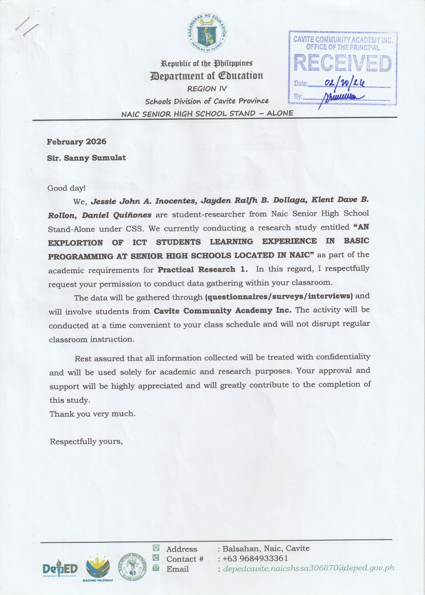

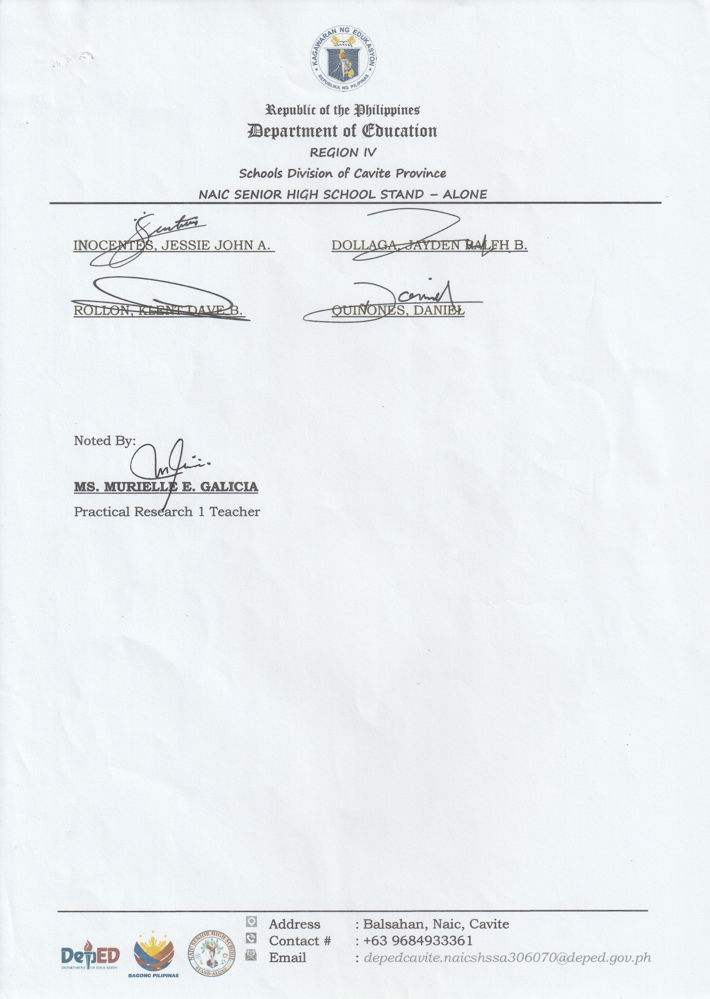

---

## **APPENDIX A: DOCUMENTATION**

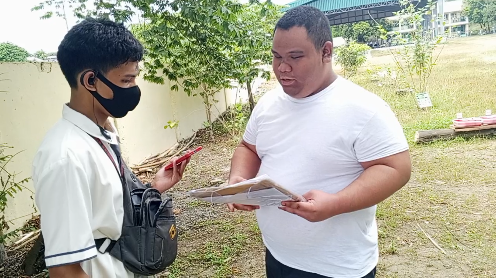
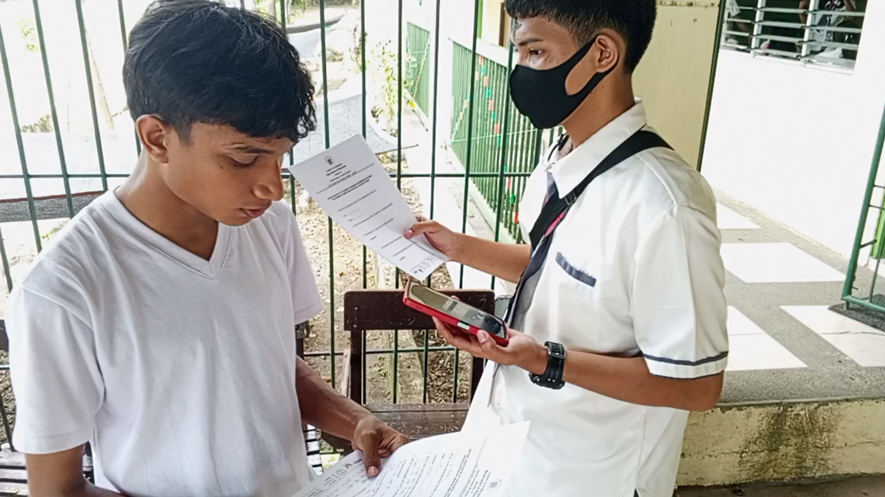
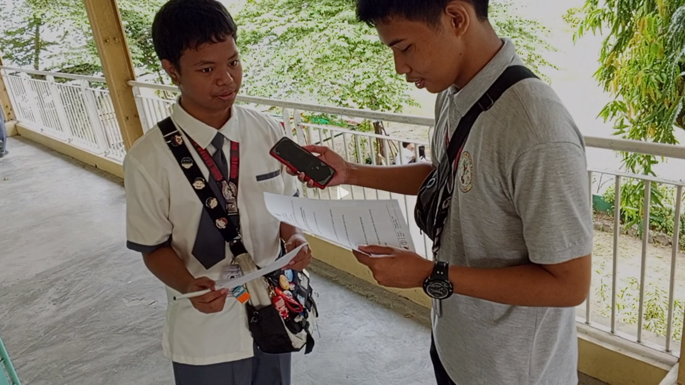

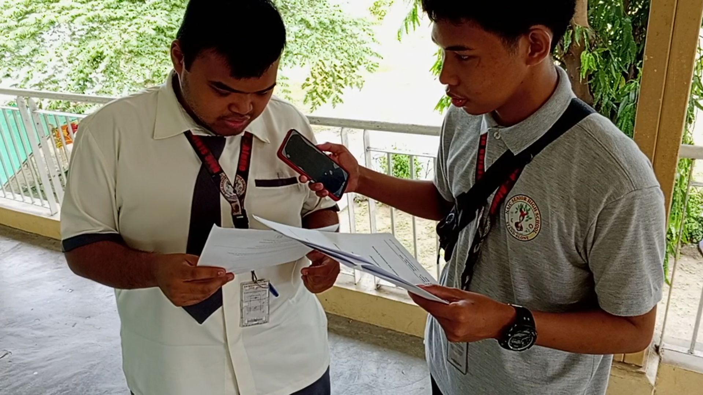
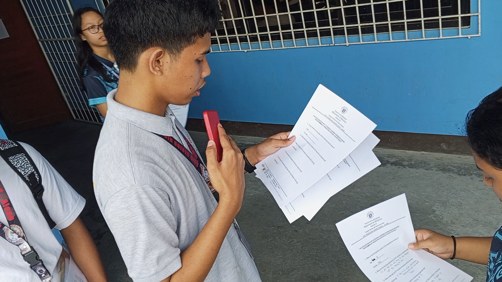
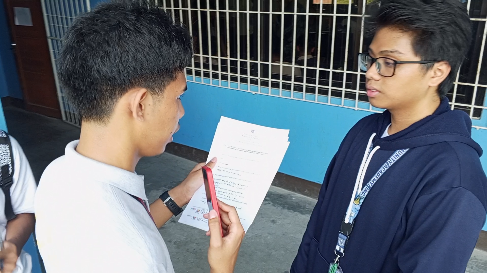
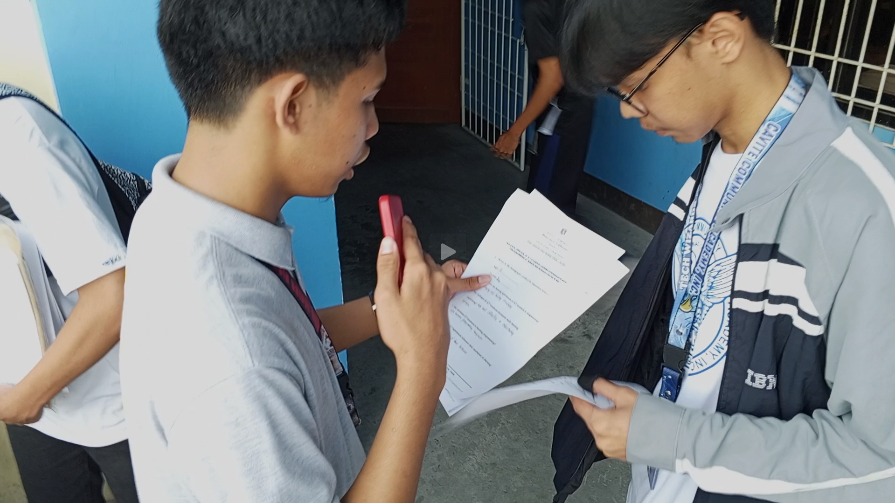
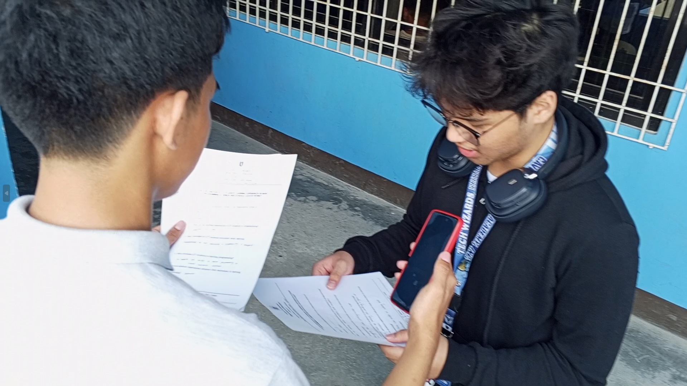
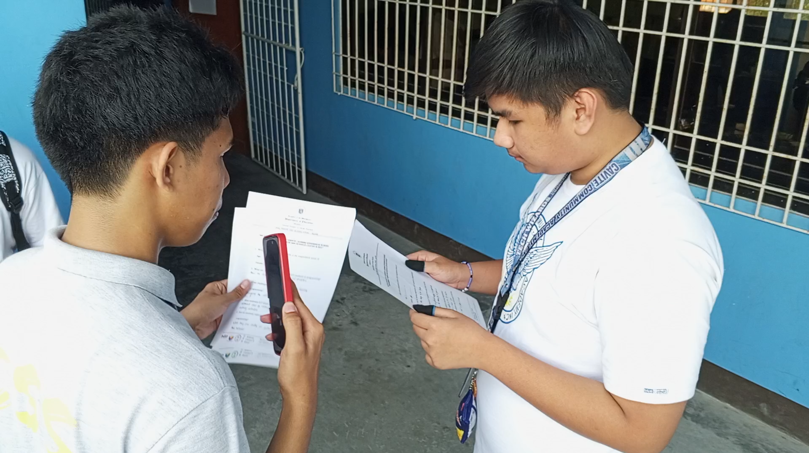
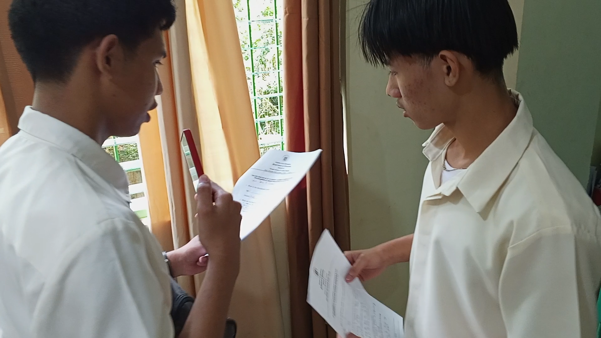
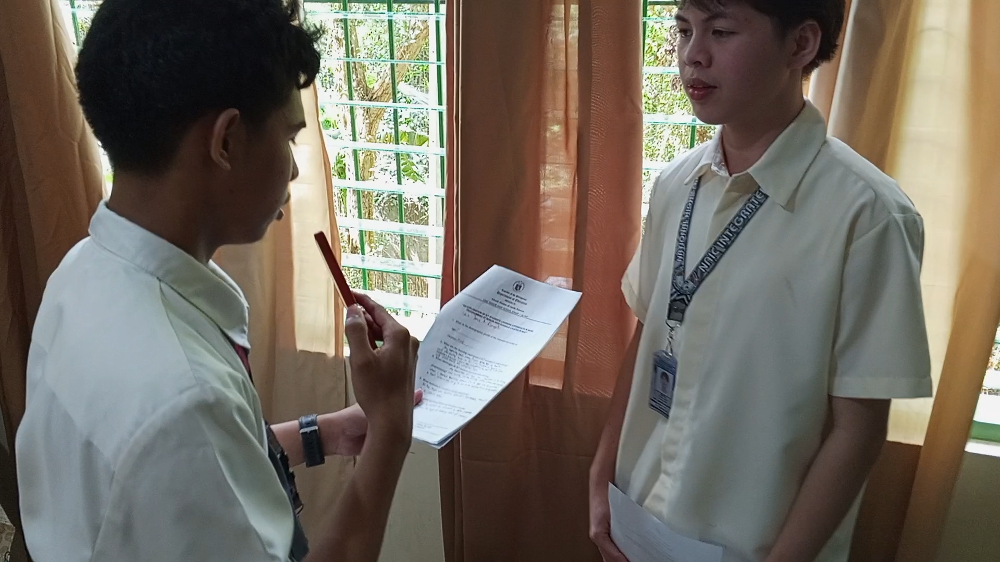

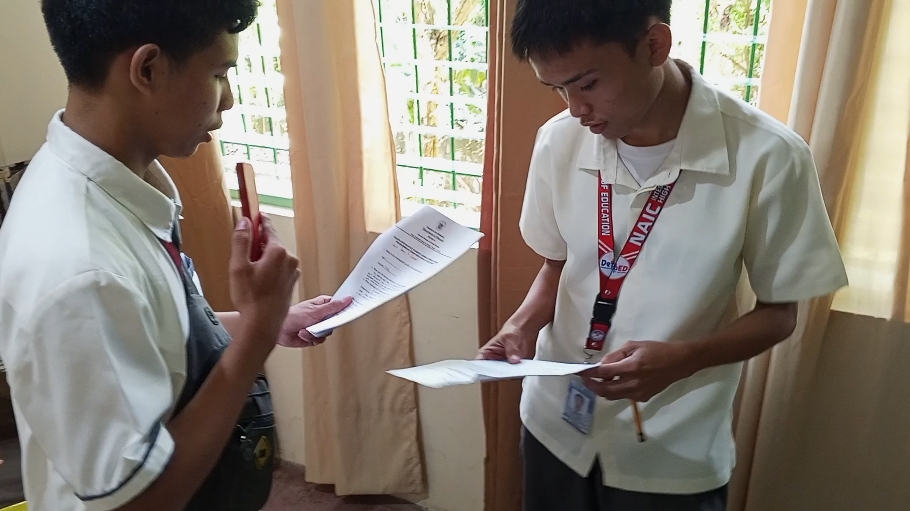
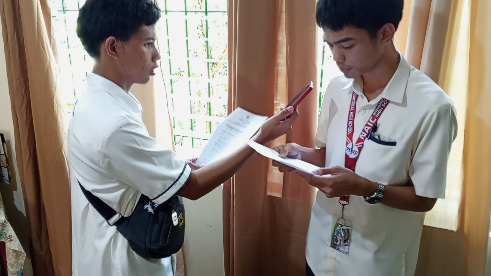

---

